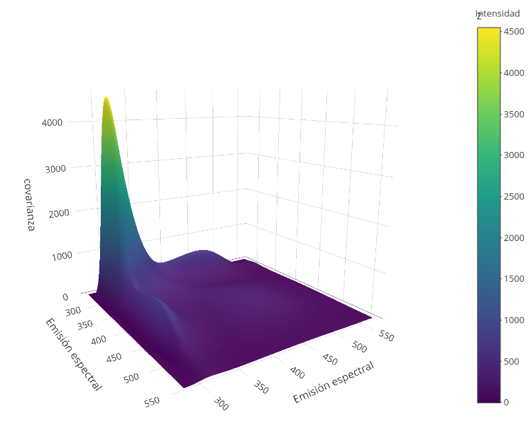

```{r Configuraciones globales, echo = FALSE}
knitr::opts_chunk$set(echo = FALSE, warnings = FALSE, message = FALSE)
```

# Primer parte

1. Usando el dataset suministrado, seleccionar un proceso.


## Información del conjunto de datos

El azúcar se disolvió en agua sin amortiguar y la solución se midió espectrofluorométricamente en una cubeta de 10 $\times$ 10 $mm^2$. Los datos en bruto se midieron con un fluorómetro. Para cada muestra, los espectros de emisión se midieron en intervalos de $0.5$ nm en siete ondas de excitación.

Es decir, tenemos una muestra de tamaño 265, en 571 puntos para cada una de las 7 ondas de longitudes de excitación.

1. En nuestro caso, decidimos tomar el nivel de excitación correspondiente al nivel de onda 340.

Para entender un poco mejor los datos, visualicemos la información sin haberla tratado (i.e. en bruto).

```{r Lectura de datos y Config. inicial}
# Lectura de datos
ruta <- './Datos/datos.txt'
# columnas <- rep(c('NULL', 'numeric', 'NULL'), 
#                 c(571 * 5, 571, 571))           # Columnas a leer
# datos <- read.table(file = ruta, colClasses = columnas)
datos1 <- read.table(colClasses = rep(c('NULL', 'numeric'), 
                                      c(6, 1)*571), file = ruta)

# Gráficos
t_rango <- seq(275, 560, by = 0.5)
matplot(x = t_rango, y = t(datos1), type = 'p', 
        pch = 19, cex = 0.2, frame = FALSE, 
        main = 'Datos observados',
        xlab = 'Emisión espectral', ylab = 'Fluoresencia')
```

Después de visualizar las funciones (sin suavizar) consideramos como más acertado usar una base de funciones *B-Spline* para llevar a cabo el suavizado, pues en los datos no se perciben comportamientos cíclicos (o sinusoidales). Como apunte adicional, mencionamos que para llevar a cabo el ajuste nos bastó con usar polinomios de grado 3 (orden 4) y para la parte que presentaba un apuntamiento muy alto usamos más *breakpoints*.

```{r Creación de base}
library(fda)                    # Librería

# Base que se va a usar
bk <- c(275, 285, 300, 320, 360.5, 389, 470, 520, 560)
bk1 <- c(seq(275, 389, by = 28.5), 470, 520, 560)
base_bsp <- create.bspline.basis(breaks = bk, 
                                 norder = 4)
```

A continuación podemos ver las versiones suavizadas de la muestra en cuestión.

```{r}
ajuste <- Data2fd(y = as.matrix(t(datos1)), basisobj = base_bsp, 
                  argvals = t_rango)
plot(ajuste, frame = FALSE, main = 'Curvas Suavizadas', ylab = 'Fluorescencia',
     xlab = 'Emisión espectral')
```

Para contrastar las estimaciones, vamos a superponer los datos sin tratar, junto con las respectivas curvas suavizadas.

```{r}
# Datos en bruto
matplot(x = t_rango, y = t(datos1), type = 'p', 
        pch = 19, cex = 0.2, frame = FALSE, 
        main = 'Muestras y curvas suavizadas asociadas', 
        xlab = 'Emisión espectral', ylab = 'Fluoresencia',
        col = 'black')

# Respectivas curvas suavizadas
lines(ajuste, lwd = 0.8, col = 'midnightblue')
legend(legend = c('Sin tratar', 'Suavizadas'), lwd = 2, 
       col = c('black', 'midnightblue'),
       x = 'topright', bg = 'gray82', box.col = 'white', 
       lty = c(1, 2), text.col = c('black', 'midnightblue'))
```

+ **Función de media:** la función de media $\bar{x(t)}$ se presenta a continuación

```{r}
#  Extraemos los objetos ajustados
ajuste_detallado <- smooth.basis(argvals = t_rango, y = t(datos1), fdParobj = base_bsp)

# Funciones ajustadas
f_hat <- eval.fd(evalarg = t_rango, fdobj = ajuste_detallado$fd)
colnames(f_hat) <- paste0('v', 1:ncol(f_hat))

# matplot(x = t_rango, y = f_hat, col = 'red', lwd = 0.5, add = TRUE, type = 'l')
matplot(x = t_rango, y = t(datos1), type = 'p', 
        pch = 19, cex = 0.2, frame = FALSE, 
        main = 'Media y datos originales', 
        xlab = 'Emisión espectral', ylab = 'Fluoresencia',
        col = 'gray')

# Agregamos la función de media
y_media <- apply(X = f_hat, MARGIN = 1, mean)
lines(x = t_rango, y = y_media, col = 'black', lwd = 3)
legend(x = 'topright', legend = c('Media', 'Datos originales'), lwd = c(3, NA), 
       col = c('black', 'gray'), lty = c(1, NA), box.col = 'white', 
       pch = 19, pt.cex = c(NA, 0.2))

# Boxplot funcional
fbplot(fit = f_hat, x = t_rango, ylim = c(-10, 500), frame = FALSE, 
       main = 'Boxplot funcional', xlim = range(t_rango),
       plot = FALSE) -> bp_funcional
order(bp_funcional$depth) -> centrales
```

+ **Función de media recortada al 10%:** veremos la media recortada, que corresponde al cálculo de la media despúes de haber recortado una cantidad de observaciones (en este, el 10% de las observaciones *menos centrales*). Vemos que las funciones menos centrales, parecen mostrar un comportamiento, como más apuntados en alguna parte o la parte central en lugar de ser decreciente crece.

```{r}
# Datos sin suavizar
matplot(x = t_rango, y = f_hat[, centrales[1:26]], type = 'l', 
        pch = 19, cex = 0.2, frame = FALSE, lty = 1, lwd = 0.8,
        col = 'cyan2', main = 'Media recortada y datos originales', 
        xlab = 'Emisión espectral', ylab = 'Fluoresencia')
# Media recortada
y_mediarec <- apply(X = f_hat[, -centrales[1:26]], MARGIN = 1, mean)

# Funciones graficadas
lines(x = t_rango, y = y_media, col = 'black', lwd = 1, lty = 2)
lines(x = t_rango, y = y_mediarec, lwd = 1, col = 'blue')

# Identificamos cada curva
legend(x = 'topright', legend = c('Media recortada', 'Media', 'Datos originales'), 
       lwd = c(1, 1, 0.8), col = c('blue', 'black', 'cyan2'), 
       lty = c(1, 2, 1), box.col = 'white') 
       #pch = 19, pt.cex = c(NA, NA, 0.2))
```

+ **Función de varianza:** se calculó usando todos los datos.

```{r}
# Función de varianza
f_var <- apply(X = f_hat, MAR = 1, FUN = var)

# Graficamos
plot(x = t_rango, y = f_var, frame = FALSE, main = 'Varianza estimada', 
     xlab = 'Emisión espectral', type = 'l', ylab = '')
```

Podemos ver igualmente, una gráfica de una "banda de confianza" (abusamos de términología para orientar la construcción del gráfico, pero no es tal).

```{r}
# Gráfica de datos sin suavizar
matplot(x = t_rango, y = t(datos1), type = 'p', 
        pch = 19, cex = 0.2, frame = FALSE, 
        col = 'gray', main = '\"Banda de confianza\"', 
        xlab = 'Emisión espectral', ylab = 'Fluoresencia')

# Media y bandas
lines(x = t_rango, y = y_media, col = 'black', lwd = 2, lty = 1)
matlines(x = t_rango, y = cbind(y_media - 1.96*sqrt(f_var), y_media + 1.96*sqrt(f_var)), 
         col = 'blue', lty = 1, lwd = 2)
legend(x = "topright", lty = 1, lwd = 2, col = c('blue', 'black'), box.col = 'white', 
       legend = c('Media', 'Límites'), bg = 'gray')
```

+ **Función de covarianza:** mostramos la superficie obtenida. Con la función *persp* obtenemos una figura no muy agradable. Sin embargo, usaremos la función *plot_ly* que graficará la superficie en una página web y tomamos capturas de pantalla.

```{r}
# Función de autocovarianza
suppressMessages(library(plotly))
n <- ncol(datos1)

z <- cov(t(f_hat)[, seq(from = 1, to = 571, by = 5)])

# persp(x = t_rango[seq(1, 571, by = 5)], y = t_rango[seq(1, 571, by = 5)], 
#       z = z, phi = 25, theta = 44, xlab = 'Emisión espectral', 
#       ylab = 'Emisión espectral', zlab = 'cov(t, s)', 
#       ticktype = 'detailed', col = 'lightblue')

g1 <- plot_ly(x = ~t_rango[seq(1, 571, by = 5)], y = ~t_rango[seq(1, 571, by = 5)],
              z = ~z, showlegend = FALSE)
# g1 %>% add_surface() %>%
#        layout(scene = list(xaxis = list(title = 'Emisión espectral'),
#                                         yaxis = list(title = 'Emisión espectral'),
#                                         zaxis = list(title = 'covarianza')), 
#               annotations = list(text = 'Intensidad', showarrow = FALSE, 
#                                  xref = 'paper', yref = 'paper'))
```

```{r, out.width = '80%'}

```

+ **La función de mediana:** corresponde a la estimación con la mayor densidad de todas las estimaciones.

```{r}
# Mediana
y_mediana <- f_hat[, which.max(bp_funcional$depth)]

# Grafiquemos las 3 funciones
matplot(x = t_rango, y = cbind(y_mediarec, y_media, y_mediana), lwd = c(1, 1, 2),
        col = c('black', 'blue', 'brown'), type = 'l', frame = FALSE, lty = 1, 
        xlab = 'Emisión espectral', ylab = 'Fluoresencia', 
        main = 'Medidas de tendencia central')

legend(x = 'topright', legend = c('Mediana', 'Media', 'Media recortada'), 
       lwd = c(2, 1, 1), col = c('brown', 'blue', 'black'),
       box.col = 'white')
```

+ **Funciones cuantiles 90% y 95%:**  en el mismo gráfico presentamos las funciones de los cuantiles solicitados.

```{r}
# Gráfico de base
matplot(x = t_rango, y = f_hat, type = 'l', 
        pch = 19, cex = 0.2, frame = FALSE, 
        main = 'Cuantiles', lty = 1,
        xlab = 'Emisión espectral', ylab = 'Fluoresencia',
        col = 'gray')

cuant_95 <- cbind(apply(X = f_hat[, -centrales[1:13]], MAR = 1, min), 
                  apply(X = f_hat[, -centrales[1:13]], MAR = 1, max))
matlines(x = t_rango, y = cuant_95, col = 'blue', lwd = 3, lty = 1)

# Cuantiles 90%
cuant_90 <- cbind(apply(X = f_hat[, -centrales[1:26]], MAR = 1, min), 
                  apply(X = f_hat[, -centrales[1:26]], MAR = 1, max))
matlines(x = t_rango, y = cuant_90, col = 'red', lwd = 2, lty = 1)
legend(x = 'topright', lwd = 3:1, col = c('blue', 'red', 'gray'), 
       legend = c('Cuantiles 95%', 'Cuantiles 90%', 'Datos'), 
       box.col = 'white')
```

+ **Región central 0.75:** 

```{r}
# Base :v
matplot(x = t_rango, y = f_hat, type = 'l', pch = 19, cex = 0.2, 
        frame = FALSE, main = 'Región 0.75', lty = 1,
        xlab = 'Emisión espectral', ylab = 'Fluoresencia',
        col = 'white')
cuant_75 <- cbind(apply(X = f_hat[, -centrales[1:67]], MAR = 1, min), 
                  apply(X = f_hat[, -centrales[1:67]], MAR = 1, max))
polygon(x = c(t_rango, t_rango[length(t_rango):1]), 
        y = c(cuant_75[, 1], (cuant_75[, 2])[length(t_rango):1]), 
        border = 'midnightblue', angle = 45, col = 'midnightblue', density = 50)
```

+ **Boxplot funcional y outliers:** los números que aparecen en la leyenda son los identificadores de las funciones $\widehat{x}$ consideradas como atípicas. En este caso, podemos considerar que se tratan de *outliers parciales*. Esto lo podemos ver con las observaciones 131, 71 y 10, pues hay una región  (intervalo 350-450 aproximadamente) en la que las curvas o bien decrecen de forma muy suave o bien se comportan de forma creciente. En cambio, el comportamiento de los individios 14 y 16 es más complejo de entender porqué son *outliers*.

```{r}
# Boxplot funcional
fbplot(fit = f_hat, x = t_rango, ylim = c(-10, 500), 
       frame = FALSE, main = 'Boxplot funcional', 
       xlim = range(t_rango), outliercol = 'white', 
       barcol = adjustcolor('midnightblue', alpha.f = 0.2), 
       color = adjustcolor('brown', alpha.f = 0.2),
       xlab = 'Emisión espectral', 
       ylab = 'Fluoresencia') -> bp_funcional
matlines(x = t_rango, y = f_hat[, bp_funcional$outpoint], lty = c(1, 2, 2, 1, 1), 
         lwd = 3,
         col = c('blue4', 'deeppink4', 'indianred4', 'chocolate4', 'gray15'))
legend(legend = bp_funcional$outpoint, x = 'topright', lwd = 3,
       col = c('blue4', 'deeppink4', 'indianred4', 'chocolate4', 'gray15'), 
       ncol = 2, cex = 0.8, box.col = 'white', lty = c(1, 2, 2, 1, 1),
       bg = 'azure1')
```

Podemos resaltar que los individuos 14 y 16 están entre los 3 elementos con menor profundidad (aproximadamente un 1.2%).

+ **Boxplot funcional ajustado y outliers:** la estimación robusta de la matriz de covarianza la llevamos a cabo apartando las funciones que arriba consideramos como atípicas. Sin embargo, la simulación de datos no la logramos hacer como se menciona en las diapositivas.

Como alternativa, proponemos basarnos en técnicas de remuestreo para estimar el boxplot sin usar los datos atípicos y definir el valor del *hiperparámetro* F.

Los gráficos nos ayudan a ver el efecto de haber cambiado el factor $F$ de 1.5 a 1.83 y vemos que la probabilidad de designar un dato atípico cuando no lo es se reduce a un 2%.

```{r}
# Fijamos semilla
set.seed(718)

# Índices sobre los que vamos a muestrear
ind <- (1:ncol(f_hat))[-bp_funcional$outpoint]

# Remuestreo
rem <- sample(x = ind, size = 100, replace = TRUE)

# Selección de observaciones
f_rem <- f_hat[, rem]

# Boxplot
par(mfrow = c(1, 2))
fbplot(f_rem, x = t_rango, xlim = range(t_rango), ylim = c(-5, 500), 
       frame = FALSE, xlab = 'Emisión espectral', cex.axis = 0.7,
       cex.lab = 0.7,
       ylab = 'Fluoresencia', main = 'Remuestreo')$outpoint
# colnames(f_rem)[c(17, 40, 55, 69, 85)]
legend(x = 'topright', legend = 'Outliers: 5%', box.col = 'white', 
       bg = 'cyan2', cex = 0.7)

# Cambiamos los factores
fbplot(f_rem, x = t_rango, xlim = range(t_rango), ylim = c(-5, 500), 
       frame = FALSE, xlab = 'Emisión espectral', factor = 1.83,
       cex.axis = 0.7, cex.lab = 0.7,
       ylab = 'Fluoresencia', main = 'Reajuste de factor F')$outpoint
# colnames(f_rem)[c(17, 40, 55, 69, 85)]
legend(x = 'topright', legend = 'Outliers: 2%', box.col = 'white',
       bg = 'cyan2', cex = 0.7)
```

Mostramos a continuación el boxplot resultante al modificar el factor F.

```{r}
# Boxplot funcional
fbplot(fit = f_hat, x = t_rango, ylim = c(-10, 500), 
       frame = FALSE, main = 'Boxplot funcional ajustado', 
       xlim = range(t_rango), factor = 1.83,
       outliercol = 'white', 
       barcol = adjustcolor('midnightblue', alpha.f = 0.2), 
       color = adjustcolor('brown', alpha.f = 0.2),
       xlab = 'Emisión espectral', 
       ylab = 'Fluoresencia') -> bp_funcional
matlines(x = t_rango, y = f_hat[, bp_funcional$outpoint], lty = 1, 
         lwd = 3,
         col = c('blue4', 'deeppink4', 'indianred4', 'chocolate4', 'gray15'))
legend(legend = bp_funcional$outpoint, x = 'topright', lwd = 3,
       col = c('blue4', 'deeppink4', 'indianred4', 'chocolate4', 'gray15'), 
       cex = 0.8, box.col = 'white', lty = 1,
       bg = 'azure1')
```


```{r}
# Estimación robusta
t1 <- sort(sample(x = 1:571, size = 100))

cov_rob0 <- cov(t(f_hat[, -bp_funcional$outpoint])[, t1])
cov_rob <- cov(t(f_hat[, -bp_funcional$outpoint]))
# 
# g1 <- plot_ly(x = ~t_rango[t1], y = ~t_rango[t1],
#               z = ~cov_rob0, showlegend = FALSE)
# g1 %>% add_surface() %>%
#        layout(scene = list(xaxis = list(title = 'Emisión espectral'),
#                                         yaxis = list(title = 'Emisión espectral'),
#                                         zaxis = list(title = 'covarianza')))

# -------------------------------------------------------- #
# --------------- Prueba de una muestra -----------------· #
# -------------------------------------------------------- #
#    set.seed(314)
#    t(mvtnorm::rmvnorm(n = 100, mean = rep(0, times = ncol(cov_rob0)), 
#                       sigma = cov_rob0)) -> m
#    matplot(x = t_rango[t1], y = m, 
#            type = 'p', lty = 1, pch = 19, cex = 0.2, col = 'gray')
#    ajuste_0 <- smooth.basis(argvals = t_rango[t1], 
#                             y = m, fdParobj = base_bsp)
#    # Funciones ajustadas
#    f_0 <- eval.fd(evalarg = t_rango, fdobj = ajuste_0$fd)
#    matlines(x = t_rango, y = f_0, type = 'l', lty = 1)
#    
#    fbplot(m)$outpoint
#    
#    # matplot(x = t_rango, y = f_hat, col = 'red', lwd = 0.5, add = TRUE, type = 'l')
#    matplot(x = t_rango, y = t(datos1), type = 'p', 
#            pch = 19, cex = 0.2, frame = FALSE, 
#            main = 'Media y datos originales', 
#            xlab = 'Emisión espectral', ylab = 'Fluoresencia',
#            col = 'gray')


### VAmos a intentar agregar esas putas líneas
# Región 0.5
#    cuant_50 <- cbind(apply(X = f_hat[, -centrales[1:134]], MAR = 1, min), 
#                      apply(X = f_hat[, -centrales[1:134]], MAR = 1, max))
#    # Rango intercuartílico
#    iqr_f <- apply(cuant_50, MAR = 1, FUN = function(x) sum(c(-1, 1) * x))
#    # Quitamos OUTliers
#    f_sinOUT <- f_hat[, -bp_funcional$outpoint]
#    # Cálculo de bigotes
#    sapply(1:nrow(cuant_50), function(k) max(f_sinOUT[k, f_sinOUT[k, ] < cuant_50[k, 2] + 1.5*iqr_f[k]])) -> bigote_sup
#    sapply(1:nrow(cuant_50), function(k) min(f_sinOUT[k, f_sinOUT[k, ] > cuant_50[k, 1] - 1.5*iqr_f[k]])) -> bigote_inf
#    # Agregamos
#    lines(x = t_rango, y = bigote_sup, lty = 2)
#    lines(x = t_rango, y = bigote_inf, lty = 2)
#    polygon(x = c(t_rango, t_rango[length(t_rango):1]), 
#            y = c(cuant_50[, 1], (cuant_50[, 2])[length(t_rango):1]), lty = 2,
#            border = 'midnightblue', angle = 45, col = 'black', density = 50)

```


